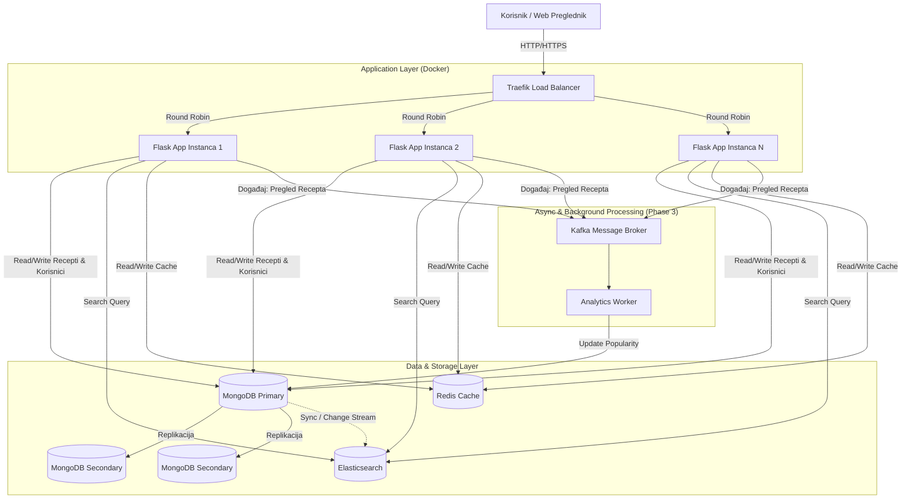
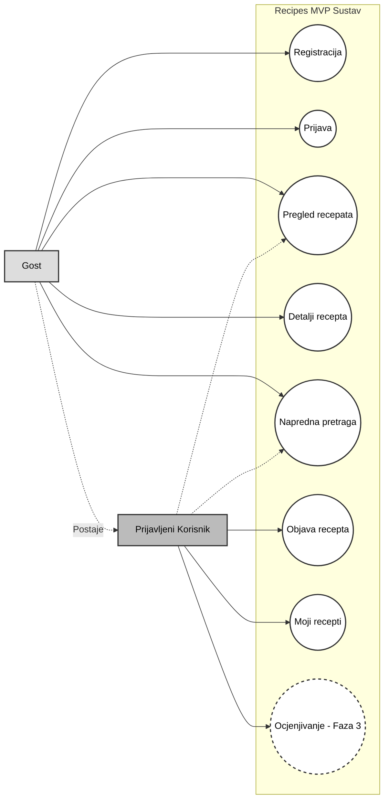

Recipes MVP – Sustav za razmjenu i pretraživanje recepata

## Opis projekta
Ova aplikacija predstavlja MVP sustava za razmjenu i pretraživanje recepata.  
Sustav omogućuje registraciju korisnika, objavu recepata te njihovo pretraživanje prema različitim kriterijima.

##  Autori
- Moira Grozdanić
- Matea Kenđel

##  1. faza – Osnovna funkcionalnost
U prvoj fazi implementirane su sljedeće funkcionalnosti:

- Registracija korisnika
- Prijava korisnika u sustav
- Objavljivanje recepata (naziv jela, popis sastojaka, postupak pripreme, kategoriju (npr. predjelo, glavno jelo, desert))
- Prikaz korisnikovih i svih objavljenih recepata
- Jednostavno korisničko sučelje (HTML + CSS)

### Tehnologije:
- **Flask** – web poslužitelj
- **MongoDB (NoSQL)** – pohrana korisnika i recepata
- **Docker** 
---

##  Arhitektura sustava
Sustav se sastoji od:
- web aplikacija pokrenute u Docker okruženju (localhost)
- NoSQL baze podataka (MongoDB)
- Traefik load balancera
- replikacije MongoDB baze radi veće pouzdanosti i skalabilnosti

##  2. faza – Napredna pretraga
U drugoj fazi proširene su mogućnosti pretrage:

- Pretraživanje recepata po:
  - sastojcima
  - tekstualnom sadržaju (naziv, opis, postupak)
  - kategoriji
 - Uveden je full-text search sustav – Elasticsearch
- Brža i učinkovitija pretraga nad velikom količinom podataka

## 3. faza – Planirane funkcionalnosti (NIJE IMPLEMENTIRANO)
uključuje:

- Ocjenjivanje recepata (1–5 zvjezdica)
- Pohranu ocjena u postojeću NoSQL bazu
- Praćenje popularnih recepata u stvarnom vremenu (npr. Kafka)
- Keširanje često pregledanih recepata (npr. Redis)

## Dijagram Arhitekture Sustava


## Use Case Dijagram


## Budući planovi

| Područje | Problem i Predloženo Rješenje |
| :--- | :--- |
| **1. Konzistentnost podataka** | Trenutno je sinkronizacija između MongoDB i Elasticsearch-a dual-write i ako aplikacija pukne nakon upisa u MongoDB, Elasticsearch ostaje neažuriran. Implementiralu bi Change Data Capture (CDC) s alatima kaošto su Debezium ili MongoDB Change Streams koji automatski slušaju promjene u bazi i šalju ih u Elasticsearch. Time se osigurava eventual consistency bez gubitka podataka. |
| **2. Skalabilnost baze podataka** | Ako količina podataka naraste (TB podataka), jedan Primary čvor postaje usko grlo za zapise. Rješenje je da koristimo sharding (npr. particioniranje prema category_id ili user_id). Podjealom baze podatka na "shardove" se opterećenje zapisa raspoređuje na više poslužitelja. |
| **3. Upravljanje sesijama** | Ako skaliramo Flask na više kontejnera, korisnik se mora ponovno prijaviti ako ga Load Balancer prebaci na drugi kontejner. To bi poboljšali tako da bi pohranili korisničke sesije u centralizirani Redis klaster i sve instance Flaska pristupaju istom Redisu, što omogućuje "stateless" aplikacijske servere. |
| **4. Sigurnost i autentifikacija** | MVP koristi osnovnu autentifikaciju i nema naprednu zaštitu od napada. Implementirali bi OAuth2 / JSON Web Tokens i Rate Limiting. JWT za autentifikaciju API-ja i konfiguracija Traefika za Rate Limiting kako bi se spriječili DDoS napadi i zloupotreba API-ja. |
| **5. Monitoring i logging** | Logovi su raspršeni po Docker kontejnerima pa je teško detektirati greške u produkciji. Centralizirali bi logging i monitoring s implementacijom ELK Stack-a (Elasticsearch, Logstash, Kibana) za prikupljanje logova te Prometheus-a i Grafane za praćenje metrika sustava (CPU, RAM, latency, broj zahtjeva). |
| **6. Deployment i orkestracija** | Docker Compose je dobar za lokalni razvoj, ali ne nudi automatsko podizanje palih servisa ili rolling updates bez prekida rada. Rješili bi to s orkestracijom kontejnera. Migracija na Kubernetes klaster omogućuje automatsko skaliranje, self-healing i rolling updates bez downtime-a. |

---

## Design Rationale

### 1. MongoDB (NoSQL baza podataka)
- Recepti su podaci koji prirodno nemaju strogu shemu (npr. broj koraka pripreme i broj sastojaka varira od recepta do recepta). JSON/BSON omogućuje nam da cijeli recept pohranimo kao jedan dokument, što pojednostavljuje dohvat podataka i ubrzava razvoj u odnosu na relacijske baze. Također MongoDB ima ugrađenu podršku za replikaciju koju koristimo za visoku dostupnost podataka.

### 2. Elasticsearch (full-text search engine)
- Iako MongoDB ima osnovne mogućnosti pretraživanja, on nije optimiziran za složene tekstualne upite. Elasticsearch koristi invertirane indekse koji omogućuju iznimno brzo pretraživanje i rangiranje rezultata prema relevantnosti, što je ključna funkcionalnost naše aplikacije. Tkođer tako što odvajamo pretragu od glavne baze podataka smanjujemo opterećenje na primarnu bazu (MongoDB).

### 3. Flask (web framework)
- Odabrali smo ga zbog svoje jednostavnosti i fleksibilnosti. Omogućuje brz razvoj MVP-a bez nepotrebnog "bloata". Python ekosustav nudi izvrsne biblioteke za rad s podacima i integraciju s AI/ML servisima u budućnosti.

### 4. Docker & Traefik
- Kontejnerizacija osigurava da aplikacija radi jednako na svakom računalu (lokalno i u oblaku). Traefik služi kao moderni Load Balancer i Reverse Proxy koji automatski otkriva nove servise, što nam omogućuje lako horizontalno skaliranje Flask instanci bez ručnog rekonfiguriranja.

##  Pokretanje aplikacije
Aplikacija se pokreće lokalno pomoću Dockera:

```bash
docker compose up --build
